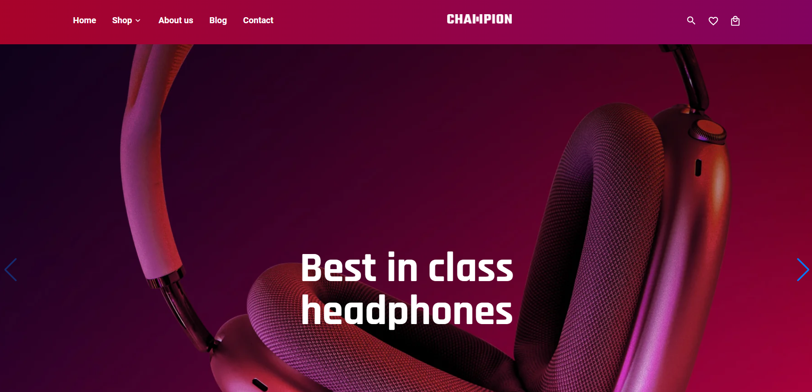
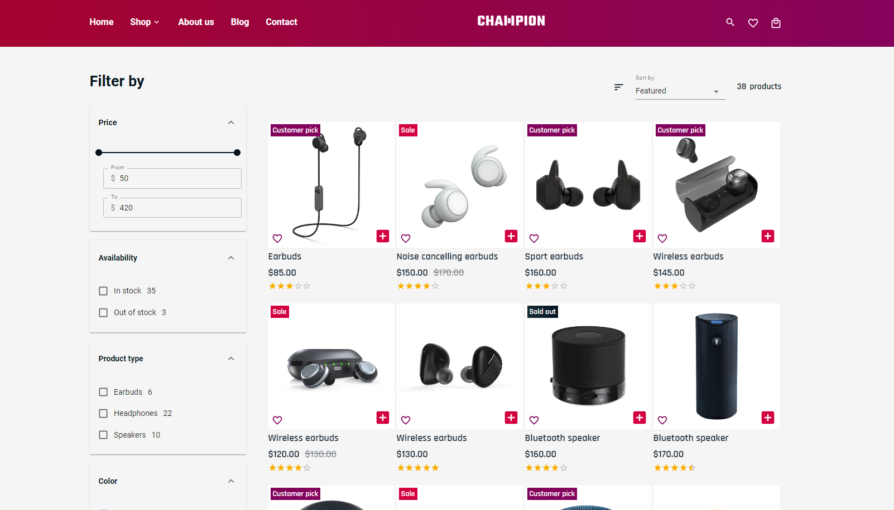
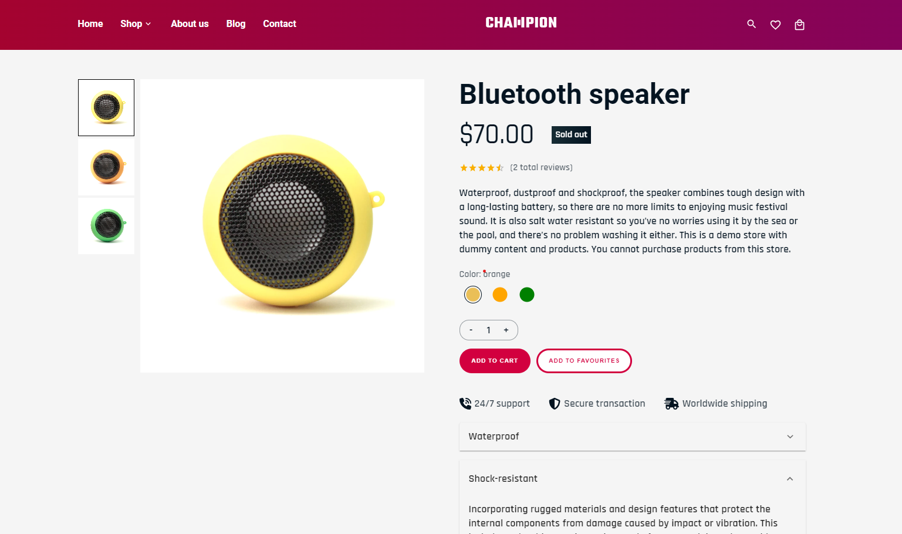
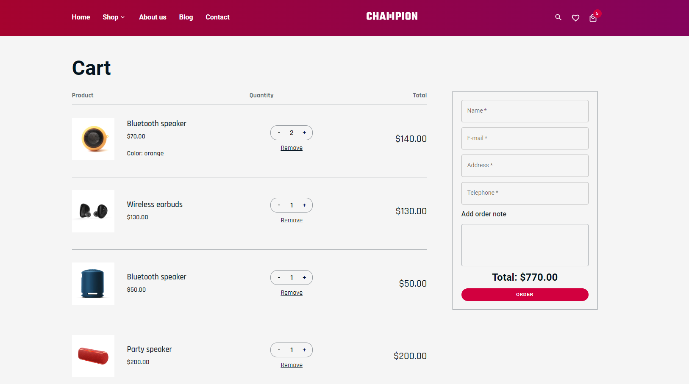
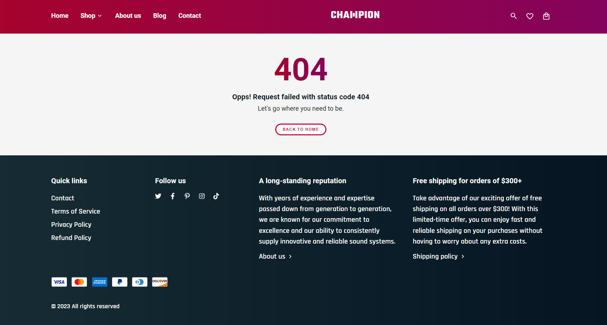

# Champion store

_(This project is currently under development and is actively being worked on.)_

Champion store project is created for educational purposes and offers a simulated e-commerce platform focusing on headphones, earbuds and speakers. The frontend is built using React and is hosted on [Vercel](https://champion-store.vercel.app/). For the backend, a JSON server is used, hosted on [Render](https://render.com/https://champion-store-server.onrender.com/).

**Note: The backend server on Render has a spinning down feature. If the server doesn't receive any requests for 15 minutes, it temporarily slows down to save resources. This may cause a brief delay when the server restarts upon receiving new requests.**

## Features

- Product Listing, Filtergiting, and Sorting
- Detailed Product Pages
- Shopping Cart with Customization
- Search Functionality

## Tech Stack

- ReactJS, Functional Components, Hooks
- Redux Toolkit, Redux-thunk for State Management
- Material UI for Styling
- Swiper for Carousels
- Axios for HTTP Requests
- Animation with [Animate.css](https://animate.style/)

## Screenshots

_Home Page_

_Product Listing_

_Product Details_

_Shopping Cart_

_Error Page_

## Get Started

1. Clone repository
2. Install dependencies: `npm install`
3. Start: `npm start`
